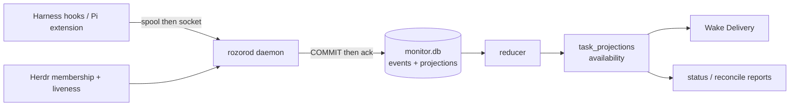

# Lifecycle Evidence

**Core question:** what is certifiably true about each session now?

## Responsibility

Turn harness-native lifecycle facts into durable, ordered evidence and reduce them into current-truth projections. This context is the semantic authority (ADR-0002/0003): events answer *what happened*, projections answer *what is true now*, and everything downstream (delivery, status, reports) reads from here.

## Anatomy

- **Producers**: per-harness [adapters](../contracts/harness-adapters.md) emit protocol-v1 events through the durable spool (reserve → send → delete on matching ACK).
- **Daemon** (`rozorod`): single-owner (`monitor.lock` with socket identity proof), imports the spool, accepts events exactly-once (`event_id` unique; ACK only after COMMIT), and folds in Herdr membership/liveness as *hosting* evidence (`herdr_pane_exists`), never as semantic truth.
- **Reducer**: strictly contiguous per-session ordering; gaps buffer and de-certify availability to `unknown`; foreground and background are independent axes; availability derives conservatively (see the [event protocol](../contracts/event-protocol.md#availability-derivation-reducer)).

## Invariants

- **Prefer unknown to inference.** Only positive evidence certifies: an explicit empty background snapshot certifies `clear`; a stop edge never does; adapter disconnect de-certifies both axes.
- **Persist facts before notifying.** Durability precedes every downstream signal.
- **Report ≠ runtime.** A `done` handoff never changes availability or implies acceptance.
- Membership truth comes from full scans of `state/*.meta`; malformed entries are errors, never evidence a task disappeared; directory-change hints only debounce scans.
- The reset boundary (`monitor.db` + sidecars + `spool/` + `producer-seq/`) moves as one unit.

## Legacy path (fenced)

The pre-daemon watcher (`watch` + per-task runtime reducer over Herdr push edges) survives as **diagnostics only**: gated by `ROZORO_LEGACY_DIAGNOSTIC=1`, its writers hard-refuse for any driver with event-bus authority, and its output shape is bridged into the current reducer for compatibility. Herdr `state_change_seq` and protocol `producer_seq` are different ordering domains and are never mixed.

## Boundary rule

Lifecycle Evidence owns durable events, ordering, and conservative reduction. It does not own hosting (Session Hosting), interruption decisions (Wake Delivery), task records (Durable Tasks), or any judgment about work quality (Policy & Steering / operator).
