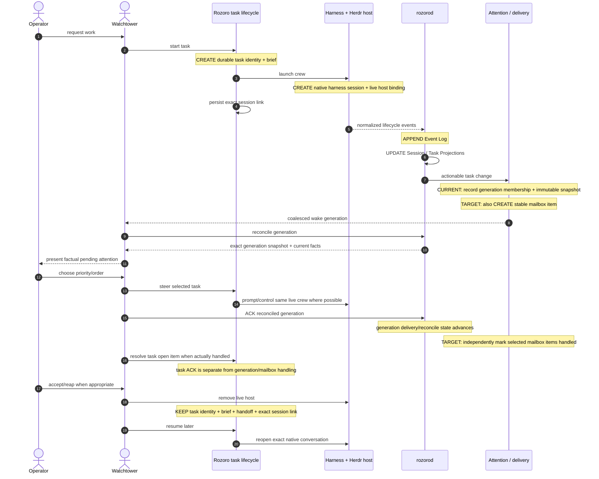

# Artifact lifecycle

This page shows when Rozoro's important artifacts come into existence and which boundaries are already implemented versus target refinements.

## Creation sequence



## Artifact view

| Artifact | First created | Updated when | Survives host teardown? | State |
|---|---|---|---|---|
| Task identity | `start` reservation | normally immutable | yes | shipped |
| Brief | task render/start | normally immutable | yes | shipped |
| Handoff/report history | first reportable turn | append per report/turn | yes | shipped |
| Native harness session | crew/watchtower launch | harness-specific | resumable where supported | shipped |
| Live host binding | launch/resume | host changes/restarts | no | shipped |
| Exact session link | successful task/session binding | refresh when native conversation changes | yes | shipped |
| Producer spool item | event reservation before daemon ACK | removed after durable import/ACK | until imported | shipped |
| Event Log record | accepted normalized event | append-only | yes | shipped |
| Session Projection | first registered/evidenced session state | relevant lifecycle events | yes | shipped |
| Task Projection | first task evidence/report reduction | lifecycle/report/action changes | yes | shipped |
| Generation membership | actionable change enters delivery ledger | immutable for that generation | yes | shipped |
| Generation task snapshot | generation creation | immutable for that generation | yes | shipped |
| Delivery offer/state | watchtower delivery cycle | offer/confirm/reconnect/reconcile transitions | yes | shipped |
| Generation ACK | successful exact reconcile | monotonically by generation | yes | shipped |
| Task open-item ACK | operator/watchtower resolves surfaced task item | per task cursor/state | yes | shipped |
| Mailbox item | meaningful task-scoped attention reason | handled/superseded metadata | yes | **target** |
| Mailbox item handled state | watchtower processes that specific item | independent per item | yes | **target** |

## Important ordering

```text
Task + session lifecycle
  ↓
normalized event
  ↓
Event Log
  ↓
Session / Task Projection
  ↓
actionable change
  ↓
CURRENT: generation membership + snapshot
TARGET:  mailbox item identity
  ↓
coalesced wake delivery
  ↓
watchtower reconcile
  ↓
operator priority decision
  ↓
selected steering/action
  ↓
generation ACK / mailbox handled state
  ↓
task open-item resolution
  ↓
operator acceptance
```

## Why the distinctions matter

Each layer answers a different question:

- **Event Log:** what happened?
- **Projection:** what is true now?
- **Generation:** which immutable batch was offered/reconciled for wake delivery?
- **Mailbox item (target):** which specific task-scoped reason still deserves watchtower attention?
- **Task open item:** what underlying work remains unresolved?
- **Operator acceptance:** are we satisfied with the result?

These are deliberately not aliases.
