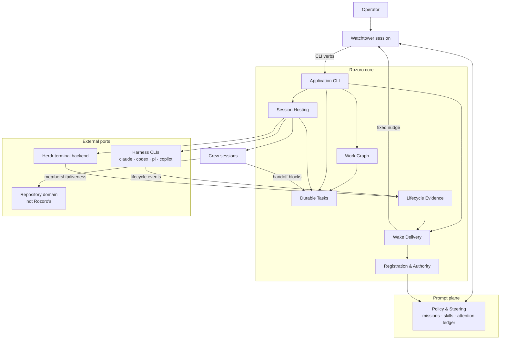

> **v2 working copy** — forked from [`docs/architecture/product-architecture.md`](../docs/architecture/product-architecture.md) at `b044dbe`. Iterate here; the v2 effort never edits the live architecture docs.

# Rozoro product architecture

**Status:** current-state architecture, derived from code and tests (not from prior docs). It is the baseline the planned rewrite and contract/ports improvements start from; divergences worth changing are catalogued in [rewrite seams](./rewrite-seams.md).

## Thesis

Rozoro lets **one primary watchtower coordinate a substantial fleet of independent agent sessions** without becoming a tab-juggler or relying on conversational memory for fleet state. It spawns and observes; it never does repository work itself.

The architecture rests on three commitments:

1. **Durable identity outlives hosting.** A task's identity, brief, report history, and exact-resume linkage survive the teardown of every terminal that ever hosted it.
2. **Evidence over inference.** Structured harness-native lifecycle facts are the semantic authority; terminal liveness is hosting truth only; where evidence is absent the system says `unknown` rather than guessing (ADR-0002).
3. **Facts, deliveries, and judgments are different things.** Events, projections, generation membership, delivery, generation ACK, task ACK, and operator acceptance are seven separate layers with separate records (ADR-0003) — and the wire format makes confusing them unrepresentable.

Rozoro is deliberately small: repository workflows, merge authority, testing policy, and harness-native subagent orchestration stay outside the core (ADR-0005). Where an external component (ACP/acpx) can satisfy a product contract, adoption is preferred over reinvention.

## Context map



**v2 addition (proposal 0001):** the Work Graph context makes the plan itself durable core state — worksets, typed dependencies, patch-only mutation, derived readiness — completing the founding principle that fleet state must not live in conversational memory. Judgment (planning, dispatch, replanning) stays with the watchtower behind the graph seams.

Context definitions live under [`bounded-contexts/`](./bounded-contexts/README.md); the interfaces between them under [`contracts/`](./contracts/README.md).

## Planes

Three planes with different rules, kept apart on purpose:

- **Data plane** — free text a model reads: briefs, `send`, handoff blocks. Always verbatim; never carries lifecycle commands.
- **Control plane** — executed operations: `control` verbs, Herdr actuation, hooks. Closed verb lists; never delivered as chat.
- **Prompt/policy plane** — composed system prompts, missions, skills, runbooks. Binds by composition and attribution (hashes), not by runtime enforcement.

The single crossing point is the wake nudge — and it is a fixed, prose-free constant precisely because it crosses from control into a live conversation. Event, task, and handoff data must never become instructions injected into a resident driver: this is the system's prompt-injection boundary, enforced at the wire level (a `notification` frame with a `message` field is invalid).

## Core loop

```text
operator intent
      │  start (reserve → render brief → spawn → link)
      ▼
crew works in its repo, appends handoff blocks
      │  harness hooks emit lifecycle events (spool → rozorod → SQLite)
      ▼
reducer projects availability per task
      │  actionable change → generation++ (membership frozen)
      ▼
live gate: driver quiescent? → fixed nudge → delivered
      │  watchtower: reconcile (delta) → status/handoff → attention ledger
      ▼
route: send follow-up · spawn next crew · ack task blocks · defer
      │
operator acceptance (never automatic)
```

## Ports

Inbound:
- **[CLI](./contracts/cli.md)** — operator and watchtower verbs; data/control separation.
- **[Event protocol](./contracts/event-protocol.md)** — producers and watchtower clients over the daemon socket.

Outbound:
- **[Herdr port](./contracts/herdr-port.md)** — tabs/panes, agent oracle, actuation, push edges. Host truth only.
- **[Harness adapters](./contracts/harness-adapters.md)** — launch mapping, lifecycle production, session discovery, exact resume per harness. Capability differences surface as `unknown`, never as inference.

Provider shapes (Herdr JSON, harness flags, session-store layouts) stop at the adapters and never leak into durable formats.

## Evidence discipline

Every claim the system makes is traceable to durable evidence with explicit provenance:

- ACK only after COMMIT; spool before send; generation before delivery; commit point before history append.
- Frozen snapshots for anything reconciled later (generation membership, report fields).
- Conservative classification everywhere a human reads output: `reported-done-unverified`, `evidence_problem` gates, inferred timestamps marked, malformed items surfaced by name.
- Attribution by bytes: preset sha, composed policy sha, capability proofs pinning exact binaries by device/inode.

## Security posture

- Owner-private everything (0600/0700), no-follow descriptor-relative I/O, dev/ino re-verification, hardlink and symlink rejection, strict JSON (duplicate members, NaN, surrogates rejected), closed wire schemas, bounded frame sizes checked before parsing.
- Threat model is explicit and fenced: no forward-progress guarantee under same-UID sabotage (ADR-0011); reviews must not silently broaden it.
- Hooks publish only opaque identifiers — never prompt or transcript content — and can never alter harness behavior.
- Tests enforce the posture end-to-end: pinned network-less containers, a real-macOS syntax/floor matrix, TAP anti-spoof gates, and a home-resolution source audit.

## Compatibility posture

- New protocol fields are optional and additive; clients omit them to degrade gracefully.
- Legacy surfaces are fenced, not removed (`ROZORO_LEGACY_DIAGNOSTIC`, authority marker refusals, mapped legacy cursors).
- Schema migrations refuse what they cannot truthfully represent; the reset boundary is one coherent unit.
- Runtime floors: bash 3.2, Python ≥3.11 (gated before side effects), Herdr 0.8.x, pinned harness capability windows (Claude `>=2.1.240 <2.2.0`).

## Non-goals

Rozoro must not become:

- a repository workflow engine (branches, PRs, CI, merge policy — the repo domain owns these);
- a harness or a subagent orchestrator (crews own their harness-native work);
- a prompt-content pipeline (no task data in notifications, no transcript publishing);
- a distributed scheduler or general actor system (one home, one daemon, filesystem truth);
- a judgment machine (it detects and routes facts; humans and missions judge);
- a second implementation of what ACP/acpx can provide behind the same product contracts.
